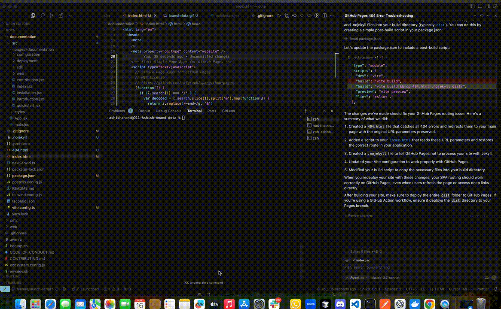

###### ⚠️ This is a fork of [code-push-server](https://github.com/microsoft/code-push-server). All credit goes to the original author.

# DOTA - Over-the-Air Updates for React Native Apps

DOTA is a self-hostable, modular toolchain that empowers React Native developers to deliver over-the-air (OTA) updates directly to user devices—bypassing app store delays and enabling rapid adoption. Deploy locally or on your preferred cloud, use the full stack or just the components you need, and extend easily with [supported plugins](documentation/plugins).

### Why DOTA?
- 🚀 Instantly push updates—no app store or distribution delays.
- 🏗️ Full control: run locally or on any supported cloud.
- 🔌 Flexible and extensible: mix, match, and extend with plugins.
- 🧑‍🤝‍🧑 **Cohorting**: Target updates by deployment key, app version, tenant, or RBAC.
- ⚡ **Force Update**: Instantly require users to update by enabling mandatory updates.
- 🗂️ **Version Control**: Multi-version, partitioned, and semantic versioning support.

## ✨ Features

- 🔄 **OTA Updates** for React Native apps
- 🏗️ **Self-hostable**: Run locally, on-prem, or in your cloud
- 🔌 **Pluggable Provider System**: Multi-platform cloud plugin provider
- 🐳 **Docker-First**: Emulated environments with LocalStack, MySQL, and more
- 🛡️ **Secure Auth**: Google OAuth or passwordless authentication mode for local/dev
- 📊 **Metrics & Monitoring**: Optional Redis integration for advanced analytics
- 🛠️ **CLI, Web Dashboard, and API**: Full toolchain for devs and ops

---

## 🔗 Quick Links

- [Quickstart Guide](https://dota.dreamsportslabs.com/documentation/quickstart)
- [Deployment Techniques](https://dota.dreamsportslabs.com/documentation/deployment/local)
- [Web Dashboard](https://dota.dreamsportslabs.com/documentation/web/dashboard)
- [CLI Usage Guide](https://dota.dreamsportslabs.com/documentation/cli/commands)
- [Plugin System](https://dota.dreamsportslabs.com/documentation/plugins)
- [Ask a Question (Discord)](https://discord.gg/Sa6a5Scj)
- [Report an Issue](https://github.com/dream-sports-labs/dota/issues)

---

## 📦 Installation

### Prerequisites

- 🐳 **Docker Desktop** (must be running)
- 🟢 **Node.js** (v18+ recommended)
- 🛠️ **Git**
- (Optional) Google OAuth credentials or use passwordless authentication mode for local login

### ⚡ Quickstart

Spin up the **entire DOTA toolchain** (API, Web, CLI) in seconds with a single command:

```bash
./launchdota.sh {directory}
# Example:
./launchdota.sh .
```

- 🌐 API server: [http://localhost:3010](http://localhost:3010)
- 🖥️ Web dashboard: [http://localhost:3000](http://localhost:3000)
- 🕹️ CLI: Open a new shell and run:
  ```bash
  dota --version
  dota whoami
  ```

> **Note:** By default, this launches a **mock local deployment** (no GCP secret required), using emulated Docker components:
> - S3 (via LocalStack)
> - EC2
> - MySQL (sandboxed)
>
> You can change provider settings (e.g., use real AWS, Azure, or GCP secrets) by editing `.env.dev.web`. For details, see the [Environment Configuration Guide](https://dota.dreamsportslabs.com/documentation/configuration/environment).



#### Option 2: Manual Local Deployment (Step-by-Step)

If you prefer a step-by-step approach instead of the one-line quickstart, follow these instructions:

1. **Clone the Repository**
   ```bash
   git clone https://github.com/dream-sports-labs/dota
   ```
2. **Create Environment Files**
   ```bash
   ./env.dev.sh
   ```
   (Copies `env.web.dev` to `.env` files in `api` and `web` directories)
3. **Navigate to API Directory**
   ```bash
   cd api
   ```
4. **Start Development Server**
   ```bash
   npm run dev:web
   ```

For more details and troubleshooting, see the [Quickstart Documentation](https://dota.dreamsportslabs.com/documentation/quickstart).

---

## 🚀 Deployment Techniques & Provider Integration

DOTA supports a flexible, plugin-based provider system. You can deploy and scale your update server in any environment:

You can change provider settings (e.g., use real AWS, Azure, or GCP secrets) by editing `.env.dev.web`. For details, see the [Environment Configuration Guide](documentation/environment).

| Mode      | Storage/DB Plugins           | Cloud Provider | Analytics Plugins | Notes                        |
|-----------|------------------------------|---------------|------------------|------------------------------|
| **Local** | JSON, LocalStack (S3, EC2), MySQL, Postgres, Redis, Azurite | Emulated           | Redis      | All-in-Docker; emulate AWS/Azure; switch DB dialect |
| **AWS**   | S3, EC2, RDS (MySQL/Postgres)| AWS           | OSS Cache      | Use real AWS credentials     |
| **Azure** | Blob Storage, App Service, Azurite, MySQL, Postgres | Azure       | Azure Redis      | Use real Azure credentials   |
| **Custom**| Any plugin (e.g., Supabase, Cloudflare, JSON, etc.) | Any           | Any               | Hybrid/multi-cloud supported |

- **Switch providers** by editing your `.env` and running the setup script.
- **Mix and match** storage, database, and analytics plugins as needed.

See the [Deployment Documentation](https://dota.dreamsportslabs.com/documentation/deployment/local) for detailed guides and configuration examples.

## 🔌 Plugin System & Extensibility

DOTA's plugin system lets you extend or replace core features:
- **Storage Plugins**: S3, Azure Blob, local, or custom.
- **Database Plugins**: MySQL, Postgres, or custom (via Sequelize dialects).
- **Auth Plugins**: Google OAuth, passwordless authentication, configurable OAuth Plugin(future, e.g [Guardian](https://guardian.dream11.com/) support).
- **Metrics Plugins**: Redis, OSS Cache, Azure Cache with Cluster Mode.
- **Cohorting Plugins**: Rule-based targeting by attributes (deployment key, app version/range, environment, user cohort, platform, app, tenant, etc.)—fully configurable via plugins (see [Plugin Guide](/documentation/plugins)).
- **RBAC Plugins**: Inbuilt, configurable (future, e.g. [Casbin](https://github.com/casbin/casbin) support).

> **Impact:** Adapt DOTA to any workflow, compliance need, or infrastructure—just like hot-updater's build, storage, and database plugins.

Want to add your own? See the [Plugin Guide](https://dota.dreamsportslabs.com/documentation/plugins).

---

## 📖 API Documentation

- [API Reference](https://dota.dreamsportslabs.com/documentation/api)
- [CLI Usage Guide](https://dota.dreamsportslabs.com/documentation/cli/commands)
- [Web Dashboard](https://dota.dreamsportslabs.com/documentation/web/dashboard)
- [Plugin System](https://dota.dreamsportslabs.com/documentation/plugins)

---

## ⚙️ TechStack Used:

- [Node.js](https://nodejs.org/)
- [TypeScript](https://www.typescriptlang.org/)
- [React](https://react.dev/)
- [Docker](https://www.docker.com/)
- [Remix](https://remix.run/)
- [Redis](https://redis.io/)
- [Sequelize](https://sequelize.org/)

---

##  Created by DreamSportsLabs

DreamSportsLabs is committed to building open-source tools that empower developers and businesses. Learn more about us at our [website](https://dota.dreamsportslabs.com/).

## 🚀 Contribute to DOTA

DOTA is an open-source project and welcomes contributions from the community. For details on how to contribute, please see our [guide to contributing](CONTRIBUTING.md).

---

## ⚖️ License

This code is provided under the MIT License, see the [LICENSE](LICENSE.txt) to learn more.

---

## ✉️ Contact

If you need feedback or support, reach out via the [Issue Tracker](https://github.com/dream-sports-labs/dota/issues) or [Discord](https://discord.gg/Sa6a5Scj).
